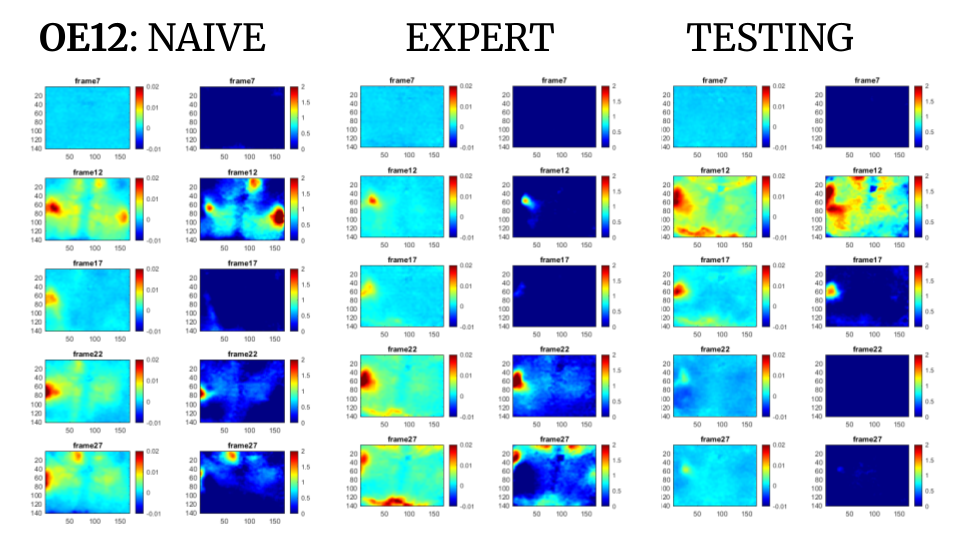

Developed under the guidance of Dr. Edward Zagha and Dominic Garcia in the Zagha Lab, this analysis script evaluates calcium imaging data from GCaMP6s mice during visual sequence discrimination tasks. This analysis aligns neural activity to specific visual stimulus frames (e.g., "AAAA", "ABCD").

## What This Script Does

- Visualizes ΔF images from trial-averaged activity
- Computes encoding strength (AUC → z-score) on a per-pixel basis
- Compares stimulus-specific activity vs. other time points
- Outputs a figure with raw ΔF on the left, encoding strength on the right
  
## Example Output

Each row of the figure corresponds to a stimulus frame (e.g., 7, 12, 17, 22, 27):

- **Left column**: Raw ΔF from average trial
- **Right column**: Encoding strength (z-score heatmap)

##

**Zagha Lab** – UC Riverside
- PI: Dr. Edward Zagha
- Focus: Neural dynamics of sensory processing and cortical control

